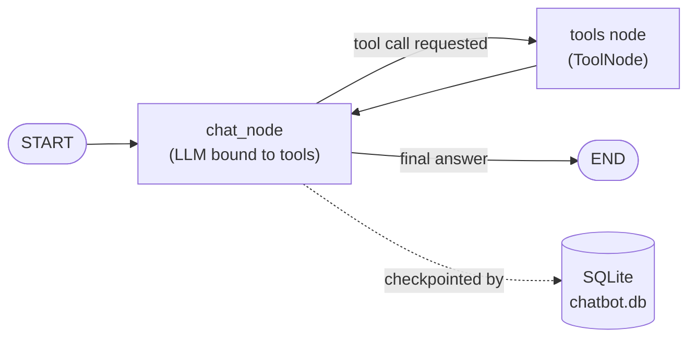

# RAG-ChatBot — Multi-Utility RAG Chatbot

A conversational AI assistant that combines **PDF-based Retrieval-Augmented Generation (RAG)** with a set of **agentic tools** (calculator, live stock prices, weather, web search, date/time), built on **LangGraph**, **LangChain**, and **Streamlit**.

Upload a PDF into any chat thread and the bot will answer questions grounded in that document — or fall back to its tools for anything else, all while keeping persistent, per-thread conversation history.

---

## ✨ Features

- **PDF Q&A (RAG)** — Upload a PDF per chat thread; it's chunked, embedded, and indexed in FAISS so the bot can answer questions grounded in that document instead of guessing from memory.
- **Tool-using agent** — A LangGraph agent that decides when to call a tool vs. answer directly:
  - 🧮 Calculator (add / subtract / multiply / divide)
  - 📈 Live stock quotes via Alpha Vantage
  - 🌦️ Current weather via wttr.in
  - 🔎 Web search via DuckDuckGo
  - 🕒 Current date & time
  - 📄 PDF retrieval tool (thread-aware)
- **Persistent multi-thread chat** — Each conversation is a separate thread with its own history, checkpointed to SQLite via LangGraph's `SqliteSaver`, so past chats survive a restart.
- **Streaming Streamlit UI** — Responses stream token-by-token, with a live status indicator showing which tool is currently being used.
- **Thread switcher** — Sidebar lists all past conversations; click one to reload it.

---

## 🏗️ How it works

The backend is a small LangGraph state machine with one LLM node and one tools node:



1. A user message enters the graph at `chat_node`, where the LLM (with all tools bound) either answers directly or requests a tool call.
2. `tools_condition` routes to the `tools` node when a tool call is present; the tool result is fed back into `chat_node`.
3. Every turn is checkpointed per `thread_id` in a local SQLite database, which is how conversation history and thread switching work.
4. PDF retrievers are built on upload (`ingest_pdf`) and kept in an in-memory, per-thread dictionary that the `rag_tool` queries using the active thread's `thread_id`.

---

## 🧰 Tech Stack

| Layer | Technology |
|---|---|
| Agent orchestration | [LangGraph](https://github.com/langchain-ai/langgraph) (`StateGraph`, `ToolNode`, `tools_condition`) |
| LLM framework | [LangChain](https://github.com/langchain-ai/langchain) (core + community) |
| Chat model | `ChatOllama` via **Ollama Cloud** (`gemma4:cloud`) |
| Embeddings | `OllamaEmbeddings` (`qwen3-embedding:0.6b`) via a **local** Ollama instance |
| Vector store | FAISS (MMR search, `k=5`, `fetch_k=20`) |
| PDF parsing | `PyPDFLoader` + `RecursiveCharacterTextSplitter` (1000-char chunks, 200 overlap) |
| Conversation memory | `langgraph-checkpoint-sqlite` (`SqliteSaver`) |
| Web search | DuckDuckGo (`ddgs`) |
| Stock data | Alpha Vantage `GLOBAL_QUOTE` API |
| Weather data | wttr.in |
| Frontend | Streamlit |

---

## 📁 Project Structure

```
RAG-ChatBot/
├── backend/
│   ├── __init__.py
│   └── rag_chat.py       # LangGraph agent, tools, PDF ingestion, checkpointing
├── frontend/
│   └── rag_stream.py     # Streamlit chat UI
├── requirements.txt
├── LICENSE                # Apache-2.0
└── .gitignore
```

---

## ✅ Prerequisites

- Python 3.10+
- [Ollama](https://ollama.com) installed locally, with the embedding model pulled:
  ```bash
  ollama pull qwen3-embedding:0.6b
  ```
- An Ollama Cloud–enabled account (the chat model is called against `https://ollama.com`) — sign in locally with:
  ```bash
  ollama signin
  ```
- A free [Alpha Vantage](https://www.alphavantage.co/support/#api-key) API key (for the stock price tool)

---

## 🚀 Installation

1. **Clone the repository**
   ```bash
   git clone https://github.com/Himanshu25G/RAG-ChatBot.git
   cd RAG-ChatBot
   ```

2. **Create a virtual environment and install dependencies**
   ```bash
   python -m venv venv
   source venv/bin/activate      # Windows: venv\Scripts\activate

   pip install -r requirements.txt
   ```

3. **Configure environment variables**

   Create a `.env` file in the project root:
   ```env
   ALPHA_VANTAGE_KEY=your_alpha_vantage_api_key
   ```

4. **Run the app** (from the project root, so `chatbot.db` is created there)
   ```bash
   streamlit run frontend/rag_stream.py
   ```

   The app will open at `http://localhost:8501`.

---

## 💬 Usage

1. On launch, a new chat thread is created automatically (visible as a UUID in the sidebar).
2. Optionally upload a PDF from the sidebar — once indexed, the bot will answer questions grounded in it.
3. Ask anything in the chat box:
   - *"What does section 3 of the PDF say about X?"* → uses the RAG tool
   - *"What's 245 * 12?"* → uses the calculator
   - *"Price of TSLA?"* → uses the stock tool
   - *"Weather in Pune right now?"* → uses the weather tool
   - *"Latest news on the RBI repo rate"* → uses web search
   - *"What's today's date?"* → uses the date/time tool
4. Click **New Chat** to start a fresh thread, or pick any past conversation from the sidebar to resume it.

---

## 🛠️ Available Tools

| Tool | Description | Backing service |
|---|---|---|
| `calculator` | Basic arithmetic (`add`, `sub`, `mul`, `div`) | — |
| `get_stock_price` | Latest quote for a ticker symbol | Alpha Vantage |
| `rag_tool` | Retrieves relevant chunks from the PDF uploaded for the current thread | FAISS (local) |
| `get_current_weather` | Current weather for a location | wttr.in |
| `get_current_date_time` | Current date and time | — |
| DuckDuckGo search | General web search | DuckDuckGo (`ddgs`) |

---

## ⚠️ Notes & Limitations

- PDF retrievers are held **in memory** (`_THREAD_RETRIEVERS`), not persisted to disk — re-uploading is needed after a server restart, even though chat history itself survives via SQLite.
- The chat model is served via **Ollama Cloud**, so an internet connection and a signed-in Ollama account are required even though embeddings run locally.
- `chatbot.db` (and its `-wal`/`-shm` files) are created at runtime and are already excluded via `.gitignore`.

---

## 📄 License

Licensed under the **Apache License 2.0** — see [LICENSE](./LICENSE) for details.

---

## 🙌 Acknowledgements

Built with [LangChain](https://www.langchain.com/), [LangGraph](https://www.langchain.com/langgraph), [Ollama](https://ollama.com), and [Streamlit](https://streamlit.io).
